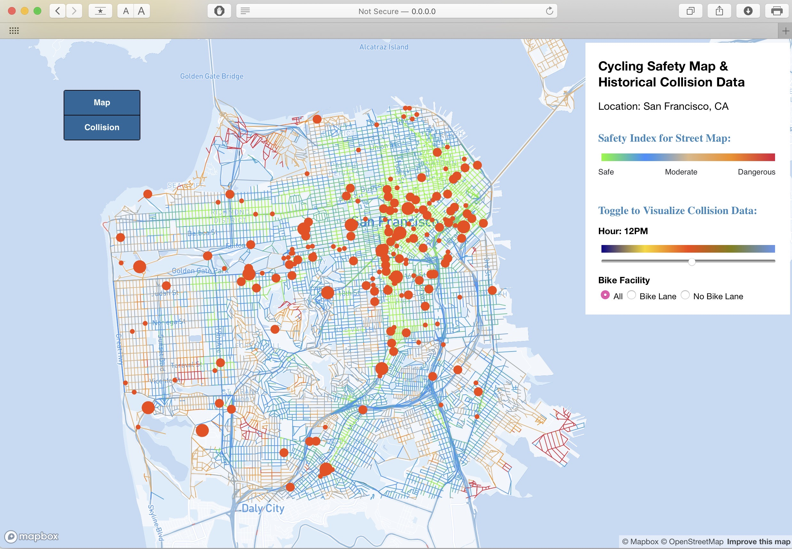

# DVA Group Project

1. Data
     &nbsp; A. download - GSV pictures
    &nbsp; B. data for models
     &nbsp; C. collision_download - GSV pictures for collision
2. Database - original collision data
3. GSV_API - Google street view code
4. Image_detect - CNN and object detection
5. Metric LR - References for our model
6. Script - codes
7. Viz - frontend
   Use python to set up local host
     &nbsp; A. static - store static data files
     &nbsp;&nbsp;&nbsp; css - css style
     &nbsp;&nbsp;&nbsp; res - all csv & GeoJSON files
     &nbsp; B. lib - library files
     &nbsp; index.html - Final html file
     &nbsp;readme.txt - setup draft for TA
8. Archive - archived files

Note: Please submit a **PULL REQUEST** when significant changes are to be made. Thanks!

